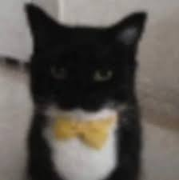

# Programación con objetos I

## Presentación Personal

### Sobre Mí
¡Hola!
Mi nombre es Alan. Este es mi segundo año en la UNAHUR y en la carrera de videojuegos.
Actualmente estoy cursando programación orientada a objetos (POO) junto a otras materias,
también relacionadas con la tecnicatura. 

Comencé con la carrera el año pasado (2024), cursando el CPU y siete materias durante este periodo.
Afortunadamente he aprobado todas y espero seguir haciéndolo. Estoy con muchas ganas de conocer 
este paradigma y todo lo que puedo a llegar a hacer con él.

Me interesa de sobremanera poder seguir aprendiendo acerca de las ciencias de la computación 
ya que me considero muy aficionado a estos ámbitos, junto al de los videojuegos.

Espero que esta cursada resulte ser entretenida y emocionante. 

### Otra Información
- Este es mi segundo contacto con Github. Todavía no me siento capaz de manejarlo a su máximo 
potencial, sin embargo tengo las nociones más básicas que requiere su uso. Intentaré apoyarme
en lo aprendido en el curso que recientemenete hice en esta universidad, el curso 'VCSs y Git'.

- Tengo un gato que se llama Roxy, tiene unos 11 años y es la que siempre me acompaña. Le tengo un
cariño infinito.

### Información Varia
- Me gusta el pan.
- Recientemente he estado jugado Slay the Spire y Fallout 3 (además del confiable PES 06).
- Este cuatrimestre estoy cursando introducicción a motores de videojuegos y el taller de diseño de 
videojuegos. 

### Un Gato
- Dejo la imagen de un gato, ya que este se parece al mío.
